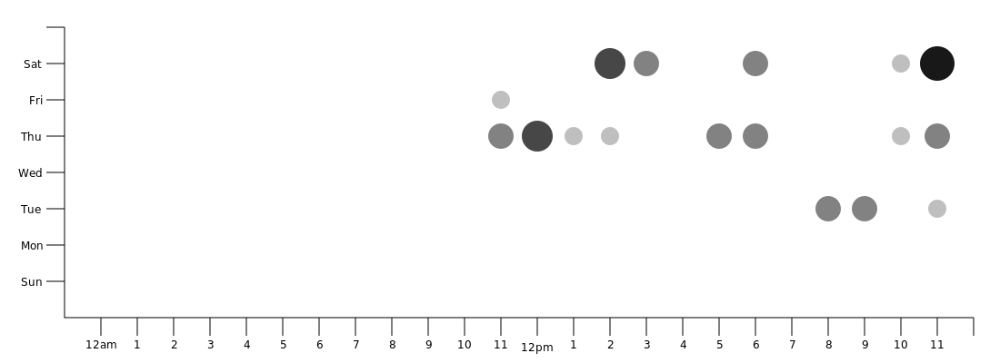
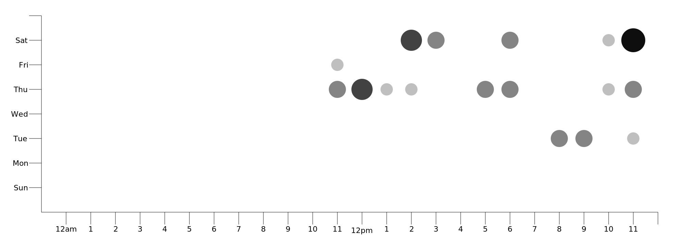
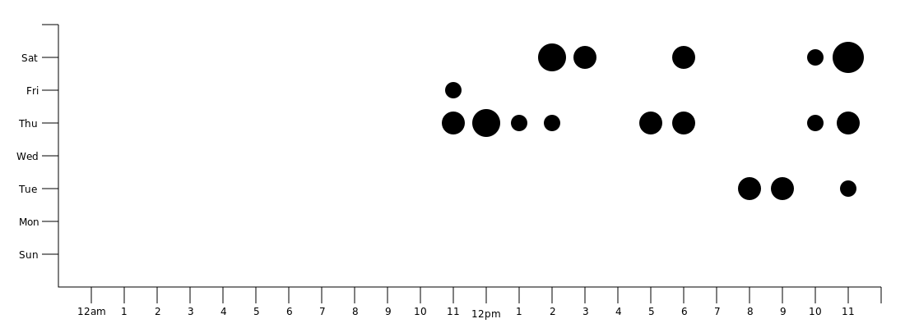
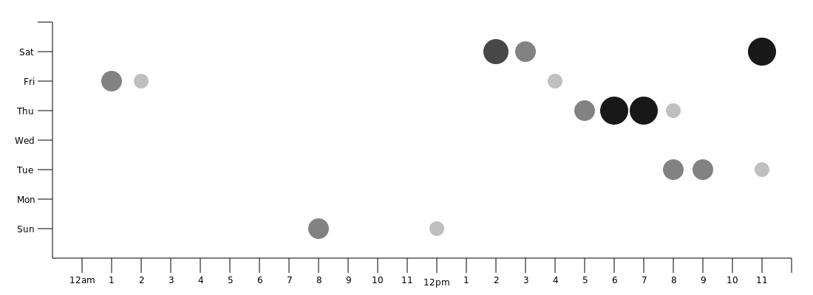

# INTRODUCTION

This is a small script to visualize the time when commits are committed in a
git repository. The idea is stolen from Github's punchcard picture(Kudos to
Github)!

## SCREENSHOTS

Here's the generated picture from MongoDB project:


## USAGE

### Basic Usage

```sh
$ ./git-punchcard
```



Provides the punchcard of the git repository at `.`

### Supply a path to the `git` repository

```sh
$ ./git-punchcard path=/media/username/code/project
```


### Supply an output file name

```sh
$ ./git-punchcard file=output-1.png
```

### Supply a width of the output file

```sh
$ ./git-punchcard width=2000
```



### Opacity of the punch marks

```sh
$ ./git-punchcard opaque=0
```

In the normal mode, the opacity of the punch marks is dependent on the size of
the punch mark. If you set opaque=0, then all the punches will be the same
color. The size will be the only indication of the number of commits in that
particular range.



### Supply output timezone

```sh
$ ./git-punchcard timezone=+8.5
```

Convert all the commit times to UTC+8.5. This is useful if the project has
contributors across the world and you want to find a common window of time when
all contributors are working.




### Git Options

You can pipe git options to the script using the flag `gitopts`

Following are only examples, any valid options that can be given to log can be
piped to `git-punchcard`

```sh
# Show a punchcard of commits from 1st January
$ ./git-punchcard gitopts="--since='1st January 2017'"

# Show a punchcard of commits from the last month
$ ./git-punchcard gitopts="--since='1 month ago'"

# Show a punchcard of commits before a particular date
$ ./git-punchcard gitopts="--before='2nd January 2016'"

# Show a punch of commits before some period
$ ./git-punchcard gitopts="--before='1 month ago'"
```

## WHY IS IT INTERESTING

It shows how this repository is developed in developer's time.  As I see it, I
can get a simple clue whether a project is a spare time project or this project
is totally under a company's control, thus resulting in commits from 8AM to
6PM, Monday to Friday.

## PREREQUISITES
------------

- python (of course!)
- pycairo module
- git

Then you're free to go!

## USAGE

- `cp git-punchcard /usr/local/bin`
- make sure that `/usr/local/bin` is in your `$PATH` environment variable.
- invoke `git punchcard`
- in the same folder, you should see a file named `output.png`, that's the generated image.

If you want a different name, then simply invoke `git punchcard file=<another-name.png>`.
The default width of a picture is 1100px.  If you'd like
to have a higher resolution, you can run `git punchcard file=<another-name.png> width=<new-width>`.

If you would like to filter by a particular author then do so as follows. (all parameters are available)
`git punchcard author=<authorname>`

The image gets scaled automatically.

LICENSE
-------

This project is under public domain, you can do whatever you want ;)
However, if you're improving this tool a bit, you can freely fork it and then
send me back a pull request. I would be very glad to integrate it.
